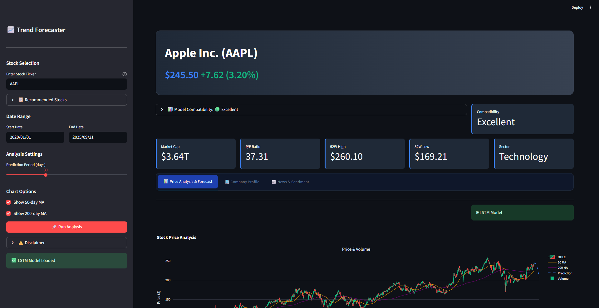

# 📈 Stock Trend Prediction - AI-Powered Financial Forecasting

A sophisticated web application that combines artificial intelligence, machine learning, and financial data analysis to predict stock market trends. Built with Python and Streamlit, this application leverages LSTM neural networks for deep learning-based price predictions while providing comprehensive market analysis, sentiment insights, and interactive visualizations.

## ✨ Key Features

### 🤖 Advanced AI Prediction Models
- **LSTM Neural Networks**: Deep learning model trained on historical stock data for accurate price forecasting
- **Dynamic Fallback System**: Intelligent trend analysis using moving averages when LSTM model is unavailable
- **Adaptive Prediction Methods**: Automatically adjusts prediction strategy based on data quality and volume
- **Multi-timeframe Analysis**: Supports prediction periods from 1 day to 90 days

### 📊 Interactive Data Visualization
- **Real-time Candlestick Charts**: Professional-grade financial charts with OHLC data
- **Technical Indicators**: 50-day and 200-day moving averages with toggle controls
- **Prediction Overlays**: Visual representation of future price forecasts
- **Volume Analysis**: Integrated volume charts for comprehensive market analysis
- **Responsive Design**: Optimized for desktop and mobile viewing

### 🏢 Comprehensive Company Analysis
- **Company Profiles**: Detailed business summaries and key executive information
- **Financial Metrics**: Real-time market cap, P/E ratio, 52-week highs/lows, and sector analysis
- **Key Ratios**: Price-to-book, EPS, dividend yield, debt-to-equity, and ROE calculations
- **Stock Compatibility Assessment**: AI-powered evaluation of how well stocks work with prediction models

### 📰 News & Sentiment Analysis
- **Real-time News Feed**: Latest financial news from multiple sources
- **AI Sentiment Analysis**: VADER sentiment analysis for news impact assessment
- **Sentiment Scoring**: Visual sentiment gauge with positive/negative/neutral classifications
- **Market Context**: News correlation with stock performance predictions

### 🎯 Smart Stock Recommendations
- **Curated Stock Lists**: Pre-selected high-quality stocks across different sectors
- **Compatibility Scoring**: Intelligent assessment of stock suitability for AI predictions
- **Quick Selection**: One-click access to popular tech, blue-chip, and financial stocks
- **Performance Indicators**: Visual feedback on prediction reliability

## 🛠️ Technologies Used

### Core Technologies
- **Python 3.8+** - Main programming language
- **Streamlit** - Web application framework for interactive dashboards
- **TensorFlow/Keras** - Deep learning framework for LSTM model development
- **NumPy & Pandas** - Data manipulation and numerical computing
- **Scikit-learn** - Machine learning preprocessing and scaling

### Data Sources & APIs
- **Yahoo Finance (yfinance)** - Real-time stock data and company information
- **Financial News APIs** - Latest market news and updates

### Visualization & UI
- **Plotly** - Interactive financial charts and graphs
- **Plotly Express** - Simplified plotting interface
- **Custom CSS** - Dark theme with glass morphism effects
- **Font Awesome** - Icon library for enhanced UI

### AI & Analysis
- **VADER Sentiment** - Social media and news sentiment analysis
- **LSTM Networks** - Long Short-Term Memory neural networks for time series prediction
- **Technical Analysis** - Moving averages, volatility, and trend analysis

## 🚀 Getting Started

### Prerequisites
- Python 3.8 or higher
- pip package manager
- Modern web browser (Chrome, Firefox, Safari, Edge)

### Installation

1. **Clone the repository:**
   ```bash
   git clone https://github.com/IleshDevX/stock-trend-prediction.git
   cd stock-trend-prediction
   ```

2. **Install required packages:**
   ```bash
   pip install -r requirements.txt
   ```

   Or install packages individually:
   ```bash
   pip install streamlit yfinance plotly plotly-express
   pip install numpy pandas scikit-learn tensorflow
   pip install vaderSentiment matplotlib
   ```

3. **Download the pre-trained LSTM model:**
   - Ensure `keras_model.h5` is in the project root directory
   - If not available, the app will automatically use trend analysis

### Running the Application

1. **Start the Streamlit server:**
   ```bash
   streamlit run app.py
   ```

2. **Access the application:**
   - Open your web browser
   - Navigate to `http://localhost:8501`
   - The application will load with the default stock (AAPL)

### File Structure
```
stock-trend-prediction/
├── app.py                 # Main Streamlit application
├── keras_model.h5         # Pre-trained LSTM model
├── LSTM_Model.ipynb      # Jupyter notebook for model training
├── README.md             # Project documentation
├── requirements.txt      # Python dependencies
└── screenshots/          # Application screenshots (optional)
```

## 📱 Application Interface

### Main Dashboard
- **Stock Selection**: Enter any valid stock ticker symbol
- **Date Range Controls**: Customize analysis period
- **Prediction Settings**: Adjust forecast duration (1-90 days)
- **Chart Options**: Toggle moving averages and technical indicators

### Analysis Tabs

#### 📊 Price Analysis & Forecast
- Interactive candlestick charts with volume analysis
- LSTM-based price predictions with confidence intervals
- Technical indicators and trend analysis
- Prediction method indicators (LSTM vs. Trend Analysis)

#### 🏢 Company Profile
- Comprehensive business summaries
- Key executive information
- Financial ratios and performance metrics
- Sector and industry classification

#### 📰 News & Sentiment
- Latest financial news headlines
- AI-powered sentiment analysis scores
- Overall market sentiment gauge
- News impact on stock performance

## 🤖 AI Model Details

### LSTM Neural Network
- **Architecture**: Multi-layer LSTM with dropout regularization
- **Training Data**: Historical stock prices with technical indicators
- **Sequence Length**: 60-day lookback window for pattern recognition
- **Prediction Method**: Return-based forecasting for better generalization

### Fallback Trend Analysis
- **Moving Averages**: 10-day and 30-day trend indicators
- **Momentum Analysis**: Recent price movement and volatility assessment
- **Mean Reversion**: Price correction mechanisms for realistic forecasts

### Stock Compatibility Assessment
- **Volume Analysis**: Trading volume evaluation for prediction reliability
- **Volatility Scoring**: Price stability assessment
- **Data Quality**: Historical data sufficiency checks
- **Compatibility Rating**: Overall suitability score (Poor/Fair/Good/Excellent)

## 📸 Screenshots

### Desktop Dashboard - Price Analysis
 <!-- Add your screenshot -->

### Price Analysis & Forecast
 <!-- Add your screenshot -->

### Company Profile & Metrics
 <!-- Add your screenshot -->

### Mobile Responsive View
 <!-- Add your screenshot -->

## 💡 Key Insights & Features

### Intelligent Prediction System
- **Dynamic Model Selection**: Automatically chooses between LSTM and trend analysis
- **Risk Assessment**: Volatility-based confidence scoring
- **Adaptive Forecasting**: Adjusts prediction methods based on stock characteristics

### User Experience
- **Real-time Data**: Live stock prices and market information
- **Caching System**: Optimized performance with data caching (5-30 minutes)
- **Error Handling**: Graceful fallbacks for data unavailability
- **Loading Indicators**: Smooth user experience with progress feedback

### Market Analysis
- **Multi-sector Coverage**: Technology, finance, healthcare, and more
- **Institutional Quality**: Professional-grade analysis tools
- **Educational Value**: Learn about technical analysis and AI predictions

## 🔧 Configuration & Customization

### Adjustable Parameters
- **Prediction Period**: 1-90 days (configurable via slider)
- **Date Range**: Historical data period selection
- **Chart Options**: Moving averages, volume, prediction overlays
- **Cache Settings**: TTL configuration for data refresh rates

### Supported Stock Markets
- **Primary**: US stock markets (NYSE, NASDAQ)
- **Coverage**: Global stocks available through Yahoo Finance
- **Data Quality**: Best performance with high-volume, established stocks

## 🚀 Performance Optimization

### Caching Strategy
- **Stock Data**: 5-minute cache for real-time updates
- **Company Info**: 15-minute cache for stable information
- **News Data**: 30-minute cache for fresh content
- **Model Loading**: Resource caching for faster predictions

### Best Practices
- **High-volume Stocks**: Recommended for better LSTM performance
- **Established Companies**: 5+ year history preferred
- **Regular Trading**: Avoid stocks with frequent gaps or splits

## 🤝 Contributing

Contributions are welcome! Please feel free to submit a Pull Request. For major changes, please open an issue first to discuss what you would like to change.

### Development Setup
1. Fork the repository
2. Create a feature branch (`git checkout -b feature/YourFeature`)
3. Commit your changes (`git commit -m 'Add YourFeature'`)
4. Push to the branch (`git push origin feature/YourFeature`)
5. Open a Pull Request

### Areas for Contribution
- **Model Improvements**: Enhanced LSTM architectures
- **New Features**: Additional technical indicators
- **UI/UX**: Interface improvements and new visualizations
- **Data Sources**: Integration with additional financial APIs

## ⚠️ Disclaimer

**Important Notice**: This application is for educational and research purposes only. Stock predictions are not financial advice and should not be used as the sole basis for investment decisions. Always consult with qualified financial advisors before making investment choices.

- **No Guarantee**: Past performance does not guarantee future results
- **Market Risk**: Stock markets are inherently volatile and unpredictable
- **Educational Tool**: Use this application to learn about AI and financial analysis

## 📊 Supported Stocks

### Recommended Categories

#### 🔥 Technology Leaders
- **AAPL** - Apple Inc.
- **GOOGL** - Alphabet Inc.
- **MSFT** - Microsoft Corporation
- **AMZN** - Amazon.com Inc.
- **TSLA** - Tesla Inc.
- **NVDA** - NVIDIA Corporation
- **META** - Meta Platforms Inc.

#### 💰 Blue Chip Stocks
- **JPM** - JPMorgan Chase & Co.
- **JNJ** - Johnson & Johnson
- **V** - Visa Inc.
- **PG** - Procter & Gamble
- **HD** - The Home Depot
- **UNH** - UnitedHealth Group

#### 🏦 Financial Sector
- **BAC** - Bank of America
- **WFC** - Wells Fargo & Company
- **GS** - Goldman Sachs Group
- **C** - Citigroup Inc.
- **AXP** - American Express

## 🛣️ Roadmap

### Upcoming Features
- [ ] **Multi-asset Support**: Cryptocurrency and forex predictions
- [ ] **Portfolio Analysis**: Multi-stock portfolio optimization
- [ ] **Advanced Models**: Transformer and attention-based architectures
- [ ] **Real-time Alerts**: Price target and trend change notifications
- [ ] **API Integration**: RESTful API for programmatic access
- [ ] **Enhanced Visualizations**: 3D charts and advanced technical indicators

### Performance Improvements
- [ ] **Model Optimization**: Faster prediction algorithms
- [ ] **Data Pipeline**: Real-time streaming data integration
- [ ] **Scalability**: Support for concurrent users
- [ ] **Mobile App**: Native mobile application

## 🙏 Acknowledgments

- **TensorFlow Team** for the powerful deep learning framework
- **Streamlit Community** for the intuitive web application platform
- **Yahoo Finance** for comprehensive financial data access
- **Plotly** for interactive visualization capabilities
- **Open Source Community** for continuous inspiration and support

## 📧 Contact & Support

**Ilesh Patel - AI/ML Developer & Data Scientist**

[](https://github.com/IleshDevX)
[](https://www.linkedin.com/in/ilesh-patel-968942270/)
[](mailto:ileshpatel666@gmail.com)

---

<div align="center">
  <p>⭐ Star this repository if you found it helpful!</p>
  <p>🚀 Built with Python, AI, and passion for financial technology</p>
  <p>📈 Made by IleshDevX</p>
</div>

**License**: MIT License - feel free to use this project for educational and research purposes.
